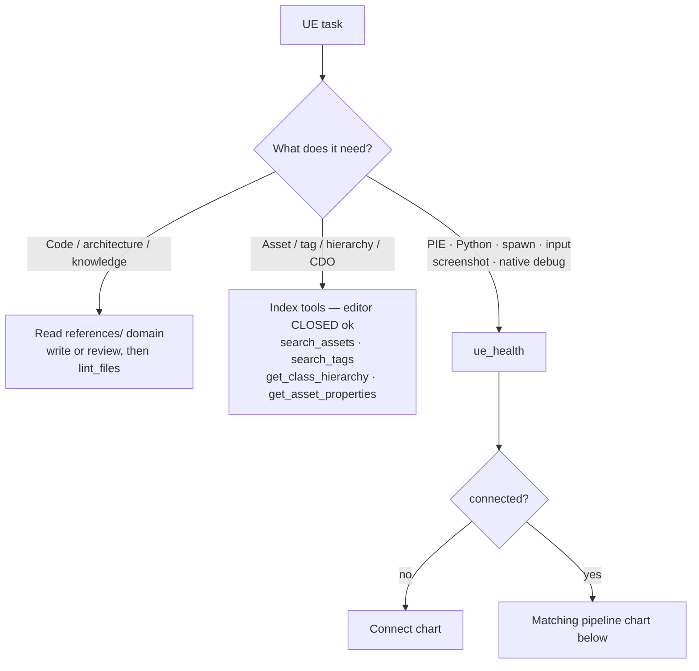
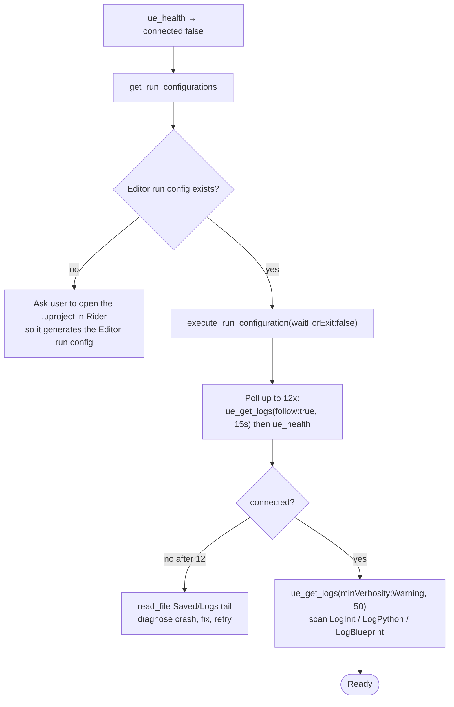
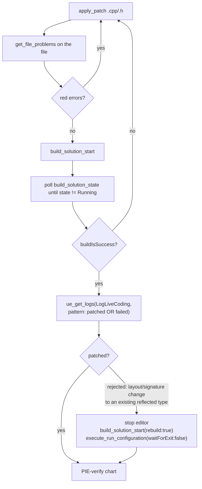
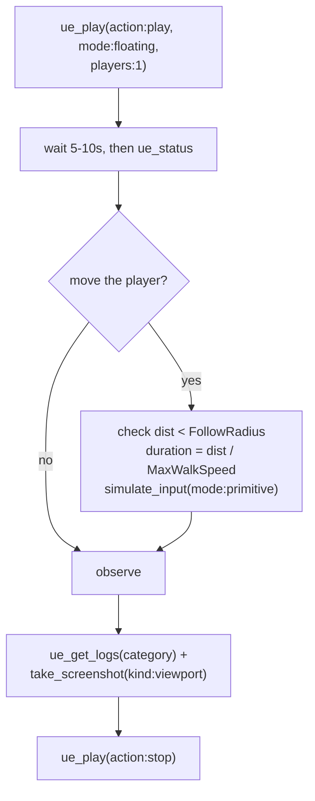
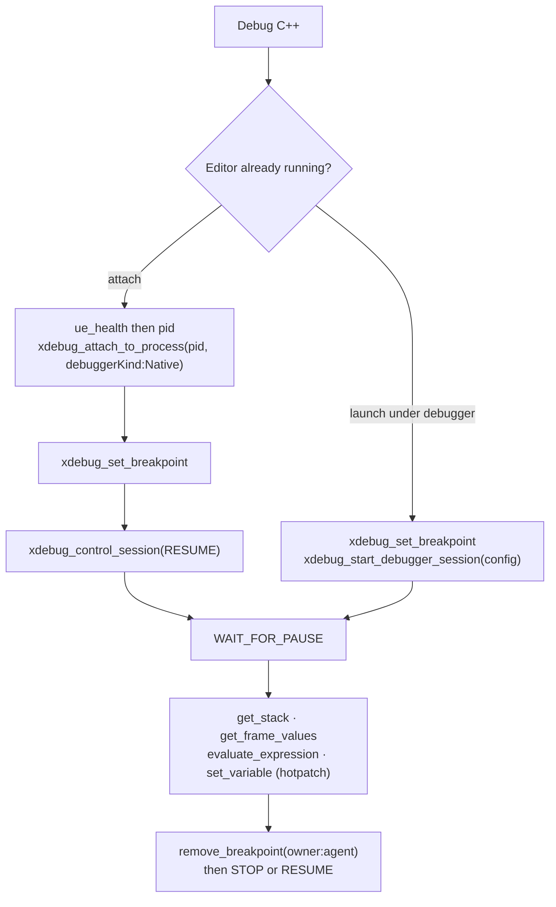

# Unreal Engine — Rider MCP Driver + Knowledge Suite

Single entry point for all Unreal Engine work. Three modes, freely combined:

1. **Live-editor automation** — drive a running UE Editor via the MCP `ue_*` tools (PIE, logs, Python, input, spawning, screenshots, camera).
2. **Offline index queries** — `search_assets` / `search_tags` / `get_class_hierarchy` / `get_asset_properties` work **with the editor closed**.
3. **Knowledge references** — generate/review code and designs against the curated docs under `references/`.

> **Read the matching `references/` file (see [Domain Routing](#domain-routing)) before generating code or calling tools.** The references hold the version-specific APIs, patterns, and pitfalls — they override stale training-data beliefs about what UE "can't do."

---

## GATE — resolve the MCP prefix first (once per session)

In this doc `mcp__<ide_mcp>__` is a placeholder; the real prefix varies (commonly `rider`).

1. Scan the `<system-reminder>` deferred-tool list for an IDE-flavored tool (`ue_status`, `ue_play`, `xdebug_*`, `execute_run_configuration`, `search_symbol`). Take the prefix between `mcp__` and the second `__` — e.g. `mcp__rider__ue_status` → `<ide_mcp>` = `rider`.
2. Prefer the prefix owning the broadest family of matching tools. **Cache it for the whole session.**
3. If nothing matches → STOP: *"I can't find the IDE MCP server. Start the IDE with the MCP server enabled and the client connected, then ask again."*

## Universal rules

- **Pass `rootFolder` on every call** — the solution root. Ask once if unknown, then reuse everywhere.
- **`ue_health` / `ue_status` first.** If `connected:false`, do not stop — run the **Connect** chart.
- **PIE transitions are async** — re-query `ue_status` ~5–10 s after any play/stop/pause.
- **`ue_play` settings are sticky** — always pass `mode`, `players`, `netMode`, `runUnderOneProcess` explicitly.
- **Index tools need no editor** — asset/tag/hierarchy/CDO queries run offline.
- **Build with `build_solution_start`** (Live Coding when the editor is connected, else UBT). Never shell-build, never ask the user to "rebuild manually."
- **`execute_terminal_command` is banned here.** The whole build → run → debug → attach path has dedicated MCP tools — use them.
- **After every `ue_execute_python`, check `LogPython` + `LogBlueprint`** — Python errors print silently, they do not raise.

---

## Pipelines (flowcharts)

These five charts encode the common Rider + UE workflows on the existing tooling. Start at **Triage**.

### Triage — route the task



### Connect — bring the editor online



> Prereq: Rider is open with this project loaded and RiderLink enabled (`Edit → Plugins → RiderLink`). The MCP connection routes through Rider — the editor process alone is not enough.

### Change C++ — edit, build, Live-Coding decision



> Live Coding hot-patches function bodies **and** compiles brand-new `UCLASS`/`USTRUCT`/`UENUM` from new files into the running editor (usable immediately — no restart). Adding a `UPROPERTY`/`UFUNCTION` to an existing type also patches in (cosmetic *"data type changes may cause packaging to fail"* warning — not a real failure; confirm via the `LogLiveCoding` line). It only **rejects** layout/signature changes to an *existing* reflected type with live instances: changed parent, removed/reordered `UPROPERTY`, altered reflected method signature → those take the rebuild branch.

### Verify in PIE — play, drive input, observe



> `simulate_input` returns immediately — the pawn has not moved at poll time. To sample live state mid-movement use a Slate post-tick callback that logs, then read it back with `ue_get_logs` (full recipe: `pipelines/p1-p10.md` → P8b). Camera and PIE pawn are independent — `viewport_camera` never touches PIE.

### Debug native C++ — attach vs launch



> Always `debuggerKind:"Native"` for UE C++ (the editor is a native process). Attaching pauses all threads — `RESUME` after setting breakpoints. `filePath` is project-relative (`Source/<Module>/<File>.cpp`). Never reuse a `frameIndex`/path token after `RESUME`/`STEP_*`.

---

## Tool surface

These tools are the **only** way to touch the editor and index. Never fall back to terminals, shell `grep`, log-file tailing, print statements, or "click in the editor."

| Group | Tools |
|-------|-------|
| **Live editor** | `ue_health` (connect check + pid) · `ue_status` (health+PIE+logs in one) · `ue_play` (`state\|play\|pause\|resume\|stop\|frame_skip`) · `ue_get_logs` (filters: `category`, `minVerbosity`, `count`, `pattern`, `follow`+`followTimeoutMs`, `sinceTimestampMs`) · `ue_execute_python` (`script`, or `scripts`+`startFrom` for resumable batches) |
| **Scene / visuals / input** | `spawn_actor` (assetPath + location) · `viewport_camera` (`get\|set\|move\|look_at\|focus_on_actor`) · `take_screenshot` (`editor_window\|viewport\|asset_preview` → returns disk path) · `simulate_input` (`actions\|primitive\|enhanced`) |
| **Index** (editor closed ok) | `search_assets` (query / baseClass) · `search_tags` (prefix) · `get_class_hierarchy` (baseClass) · `get_asset_properties` (abs path → CDO values) · `find_default_value_overrides` (className+fieldName) |
| **Build** | `build_solution_start` (`rebuild`, `filesToRebuild`) · `build_solution_state` (poll by sessionId) |
| **Run config** | `get_run_configurations` (list, or `filePath`→run points) · `execute_run_configuration` (`configurationName` or `filePath`+`line`; `waitForExit:false` for editor/servers) |
| **Code** | `read_file` · `apply_patch` · `create_new_file` · `search_symbol` / `search_text` / `search_regex` / `search_file` · `get_symbol_info` · `analyze_calls` · `get_file_problems` / `lint_files` / `get_project_problems` · `reformat_file` · `rename_refactoring` · `open_file_in_editor` · `list_directory_tree` |
| **Debug** (`xdebug_*`) | `attach_to_process` · `start_debugger_session` · `start_mixed_mode_debug` · `control_session` · `set_breakpoint` / `remove_breakpoint` / `list_breakpoints` · `run_to_line` · `get_stack` / `get_threads` / `get_frame_values` / `get_value_by_path` · `evaluate_expression` · `set_variable` · `memory_dump` |

> **Tools that do NOT exist here** (don't simulate them): `get_inspections`, `apply_quick_fix`, `replace_text_in_file`. For problems use `get_file_problems`/`lint_files`; to fix, edit the file directly. If a needed tool is missing, tell the user which MCP module to enable.

### Resolve-once path variables

| Variable | How |
|----------|-----|
| `<PROJECT_ROOT>` | the session `rootFolder` |
| `<PROJECT_NAME>` | `search_file(q:"*.uproject")` → strip `.uproject` |
| `<PROJECT_LOG>` | `<PROJECT_ROOT>\Saved\Logs\<PROJECT_NAME>.log` (read with `read_file`) |

---

## Domain Routing

All paths are relative to `references/`. **Read the listed folder's file(s) before acting.** Editor-automation domains need the editor connected; index + knowledge domains do not.

| Domain | Trigger / symptoms | `references/` |
|--------|--------------------|---------------|
| **Pipelines** | multi-step recipe (spawn → play → input → screenshot → verify); follow a proven flow | `pipelines/p1-p10.md` |
| **Editor / PIE / Logs** | play/pause/stop, log streaming, editor scripting, "nothing happens on Play" | `editor/` — see the strict file index below |
| **Visuals** | screenshot, drive viewport camera, "I can't see what's on screen" | `visuals/`, `editor/viewport-camera.md` |
| **Scene** | place/move/delete an actor without asking the user | `scene/` |
| **Input** | pawn won't move in PIE, Enhanced Input, mapping contexts, press keys/axes | `input/` |
| **Editor Python** | no dedicated `ue_*` tool for the editor action — script it | `python/` |
| **Build / Long-ops** | C++ "not taking effect", recompile/hot-reload, cook/package | `build/` |
| **Assets** | find `.uasset`/`.umap` by name or base class, BP hierarchy, CDO defaults, tags | `assets/` |
| **C++ Code** | new class/component/subsystem, UPROPERTY/UFUNCTION, reflection, GC, review | `coder/` |
| **Blueprint** | BP graph edit, pin/node wiring, copy/paste nodes between graphs | `blueprint/` |
| **Architecture** | system design, patterns, module/plugin boundaries, design review | `architect/` |
| **AI / BT / State Tree / EQS** | NPC won't move/sense, pathfinding/nav gaps, BT vs State Tree | `ai/` |
| **Animation** | AnimBP, montages, blend spaces, IK, ragdoll, ShouldMove/state machine | `animation/` |
| **GAS** | ability won't activate, attribute/effect not applying, damage pipeline | `gas/` |
| **GameplayCues** | VFX/SFX not firing on ability/hit, cue not triggering/replicating | `cue/` |
| **Networking** | "works on server not client", value won't replicate, RPC, authority, desync; **verify/test replication in PIE, or a GAS prediction-key ensure on a predicted ability** → `networking/replication-testing-pie.md` | `networking/` |
| **Physics** | trace/overlap returns nothing, clipping, ragdoll/constraint, collision channels | `physics/` |
| **Graphics / Rendering** | artifacts, lighting/shadow wrong, low GPU fps, Nanite/Lumen/TSR, RDG, shaders | `graphics/` |
| **Materials** | material graph wrong, shader effect, instance/param, UV/texture | `material/` |
| **Level Design** | World Partition/streaming, landscape, lighting/atmosphere, organization | `level-design/` |
| **Data** | DataTables, DataAssets, Asset Manager, CurveTables | `data/` |
| **PCG** | procedural graph, scatter/biome, custom node, PCG performance | `pcg/` |
| **Cinematics** | Sequencer, camera cuts, Movie Render Queue | `cinematics/` |
| **Debugger** | crash/assert, step/inspect a live value, hotpatch a variable mid-run; **runtime console commands** (`stat`/`show`/`log`/`obj`/`net`/Insights) → `debugger/console-commands.md` | `debugger/` |
| **Platform / Packaging** | packaging/cook fails, INI/config, deploy to device, platform settings | `platform/` |
| **Plugin** | new plugin scaffolding, module won't load, `.uplugin`/dependency setup | `plugin/` |
| **Profiler** | "the game is slow", hitches, CPU/GPU/memory bottleneck, Unreal Insights | `profiler/` |
| **Testing** | automation/functional tests, Gauntlet, CI verification | `testing/` |
| **UI (UMG)** | widget won't show/update, menu/HUD layout, focus/navigation | `ui/` |
| **UI C++** | C++ widget class, BindWidget, MVVM ViewModel wiring | `ui-cpp/` |
| **Console / UE Python API** | a console command/cvar, per-module Python API lookup | `console/` |

### Editor domain — strict file index (`references/editor/`)

The **Editor / PIE / Logs** row above resolves to these files. Open the specific one for the task — do not guess from the folder name:

| File | Read it for |
|------|-------------|
| `editor/pie-tools.md` | `ue_play`/`ue_status`/`ue_get_logs` contracts, PIE play modes, network topology quick-pick, log-streaming + the background-monitor (P9) — **the PIE/log workhorse** |
| `editor/recipes.md` | Python editor recipes via `ue_execute_python`: coordinate system & FRotator order, `find_look_at_rotation` camera, screenshot protocol, line traces / HitResult parsing, spawning, fog/sky/post-process gotchas, Asset Registry search, Blueprint class (`_C`) access, non-deprecated level save |
| `editor/viewport-camera.md` | drive the **design-time** level viewport via `viewport_camera` (`get`/`set`/`move`/`look_at`/`focus_on_actor`); spawn-and-frame loop. Does **not** move the PIE camera |
| `editor/world-partition-operations.md` | load/pin World Partition regions, query `get_actor_descs()` without loading, ActorDesc fields, "Not Loaded Region(s)" |
| `editor/niagara.md` | Niagara Python API **limits** — what Python can/can't do; reuse-existing vs place-and-tell-user; properties that crash |
| `editor/docs_python_scripting.md` | Python environment, execution methods, `set_editor_property` vs direct access, transactions, slow-task progress, logging |
| `editor/docs_editor_utilities.md` | Editor Utility Widgets/Blueprints, Scripted Actions, Call-in-Editor, startup objects |
| `editor/docs_subsystems.md` | subsystem types (Engine/Editor/GameInstance/LocalPlayer), lifecycle, access patterns, authoring a custom subsystem |
| `editor/docs_remote_control.md` | Remote Control HTTP (`:30010`) / WebSocket (`:30020`) API, object-path format, presets |
| `editor/docs_scriptable_tools.md` | Scriptable Tools framework — custom interactive editor tools without C++ |

### Console commands — runtime debug & profile lever (`debugger/console-commands.md`)

Console commands inspect and profile a **running** editor/PIE with no rebuild — the fastest diagnostic loop. Run any of them through `ue_execute_python`:

```
ue_execute_python(script='import unreal; unreal.SystemLibrary.execute_console_command(None, "stat unit")')
```

Then read the result the right way: **overlay** commands (`stat`, `show`, `viewmode`, `ShowDebug`) draw in the viewport → verify with `take_screenshot(kind:"viewport")`; **text** commands (`obj list`, `memreport`, `stat dump*`) print to the log → read with `ue_get_logs`. Open `debugger/console-commands.md` for the full catalog; high-value entry points:

| Goal | Command(s) |
|------|-----------|
| Frame timing (**start here**) | `stat unit` · `stat unitgraph` · `stat fps` |
| Subsystem cost | `stat game` · `stat gpu` · `stat scenerendering` · `stat rhi` · `stat ai` · `stat anim` |
| Visual debug overlays | `show collision` · `show navigation` · `ShowDebug AI\|ABILITYSYSTEM\|NET\|MOVEMENT` |
| Runtime log verbosity | `log <Category> <Verbose\|Warning\|off>` (e.g. `log LogNet Verbose`) |
| UObject / GC / leaks | `obj list class=…` · `obj gc` · `obj mark` → `obj markcheck` · `obj refs name=…` |
| Network emulation | `net PktLag=100 PktLoss=5` (reset: `net PktLag=0 PktLoss=0`) |
| Profiling capture | `stat startfile`/`stat stopfile`; `Trace.Start cpu,gpu,frame`/`Trace.Stop` (Unreal Insights) |
