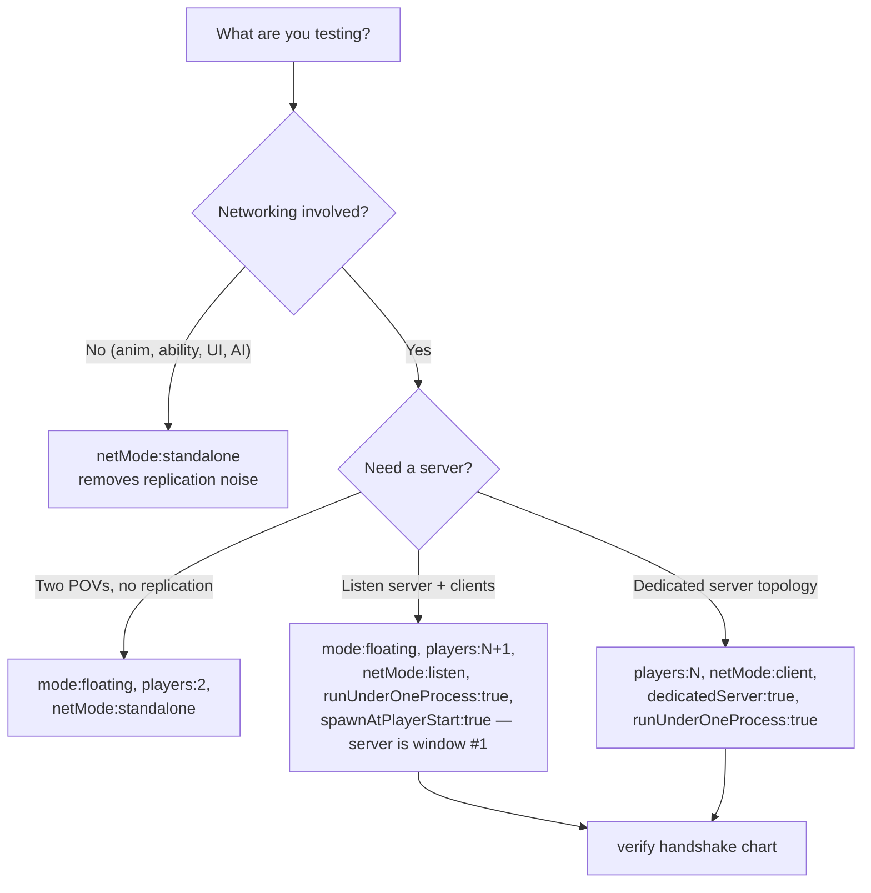
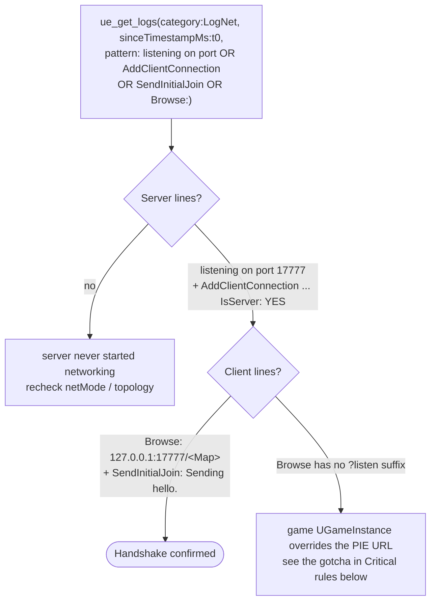
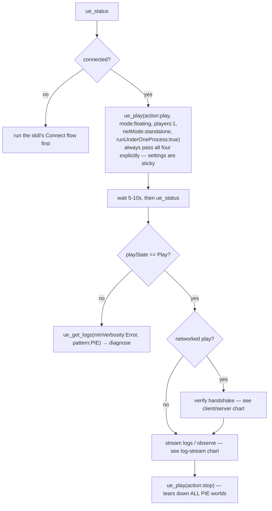
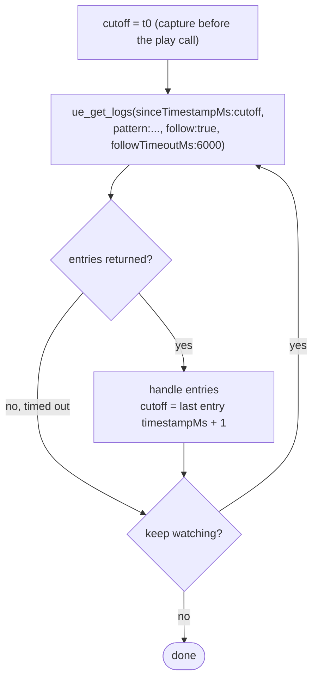

# rider-ue-developing:editor — Editor Lifecycle, PIE, Log Streaming

## Tool reference

| Tool | Purpose | When to use |
|------|---------|-------------|
| `ue_health` | RiderLink connection, project name, editor PID | First call when you only need health, no logs |
| `ue_status` | One-stop pulse: `{connected, projectName, processId, playState, recentLogs[]}`. Takes same filters as `ue_get_logs`. | Preferred over separate health + play-state + logs calls |
| `ue_play` | Action-driven PIE controller: `state` reads; `play` / `pause` / `resume` / `stop` / `frame_skip` | Drive PIE from chat |
| `ue_get_logs` | Stream log entries with category / verbosity / count / timestamp / pattern / follow filters | Replace tail-on-file; always filter |

## `ue_play` — actions and params

| Action | Effect | Params honoured |
|--------|--------|-----------------|
| `state` | Read-only. Returns current PIE state. | — |
| `play` | Persists settings to `ULevelEditorPlaySettings` via SaveConfig, then fires. | `mode`, `players`, `netMode`, `dedicatedServer`, `spawnAtPlayerStart`, `compileBeforeRun`, `runUnderOneProcess` |
| `pause` / `resume` / `stop` | Operate on running PIE. `stop` tears down ALL active PIE worlds. | — |
| `frame_skip` | Advance one frame. Only valid while `state == "Pause"`. | — |

**`mode`** — int 0–5 or case-insensitive alias:

| Int | Aliases | What you get |
|-----|---------|--------------|
| 0 | `viewport`, `selected` | PIE inside selected viewport (no new window) |
| 1 | `mobile`, `mobilepreview` | Mobile preview window |
| 2 | `floating`, `new-window` | New editor window per client/server |
| 3 | `vr` | VR preview |
| 4 | `standalone`, `process` | Separate OS process |
| 5 | `simulate`, `simulation` | Simulate in editor — no Pawn, no input |

**`netMode`** — case-insensitive alias → `EPlayNetMode`:

| Alias | EPlayNetMode | What you get |
|-------|-------------|--------------|
| `standalone` (default), `single` | `PIE_Standalone` | No networking. `players > 1` produces multiple disconnected standalone instances. |
| `listen`, `listenserver`, `host` | `PIE_ListenServer` | First PIE window opens the map with `?listen` → listen server on `127.0.0.1:17777`. Remaining `players - 1` windows are clients. |
| `client` | `PIE_Client` | All PIE windows are clients. Pair with `dedicatedServer=true` for a headless server (else nothing to connect to). |

**Other PIE knobs:**

| Param | Default | Controls |
|-------|---------|---------|
| `players` | 1 | Client window count (1–4) |
| `dedicatedServer` | false | Spawn headless dedicated server alongside clients |
| `spawnAtPlayerStart` | false | Spawn at PlayerStart instead of camera location |
| `compileBeforeRun` | false | Compile before launching PIE |
| `runUnderOneProcess` | true | All PIE instances share editor process |

## Network topology — quick-pick



Start at the **simplest** shape that reproduces the bug (listen-server before dedicated; one process before `runUnderOneProcess=false`). Scale up only once client/server confidence is high — separate processes and dedicated servers add GC/audio/IPC noise that masks gameplay logic bugs.

| Scenario | Call | Notes |
|----------|------|-------|
| Single-player / AI sandbox | `ue_play(action="play", mode="viewport")` | Default `standalone` is correct; don't touch `netMode` |
| Multi-window standalone (two POVs, no networking) | `ue_play(action="play", mode="floating", players=2, netMode="standalone")` | Each PIE world is independent; no replication |
| Server + 1 client, same process | `ue_play(action="play", mode="floating", players=2, netMode="listen", runUnderOneProcess=true, spawnAtPlayerStart=true)` | First window is listen-server; second is client. Default for client/server debugging. |
| Server + N clients, same process | same, with `players=N+1` | Server is window #1; clients are #2..N+1 |
| Dedicated server + N clients, same process | `ue_play(action="play", mode="floating", players=N, netMode="client", dedicatedServer=true, runUnderOneProcess=true)` | Closest to shipped MP topology inside the editor |
| Separate OS processes | any network shape + `runUnderOneProcess=false` | Slower; separate per-process logs; real socket marshalling |
| Standalone game process | `ue_play(action="play", mode="standalone")` | Heavy iteration; verifies shipping-config issues |

### Verify the handshake

Before drawing any gameplay conclusion from a networked play, confirm the connection actually formed — require **both** the server and client lines:



## `ue_get_logs` filters

| Param | Default | Notes |
|-------|---------|-------|
| `category` | — | Exact match: `LogTemp`, `LogNet`, `LogLiveCoding`, `LogPython`, … |
| `minVerbosity` | — | `Fatal \| Error \| Warning \| Display \| Log \| Verbose \| VeryVerbose` |
| `count` | 200 | 1–1000 |
| `sinceTimestampMs` | — | Epoch ms; use `lastEntry.timestampMs + 1` between polls |
| `pattern` | — | Kotlin/Java regex matched against `entry.message` (AND with other filters) |
| `follow` | false | Long-poll — blocks until entry lands or `followTimeoutMs` elapses |
| `followTimeoutMs` | 30000 | 1–600000; only used with `follow=true` |

## Standard PIE workflow



`ue_play(action="play")` returns the **pre-fire** snapshot — never trust it; always re-query `ue_status` after the wait. For networked plays, an ini showing `PIE_ListenServer` is necessary but **not** sufficient — require the `LogNet` handshake lines (next section).

## `ue_play` parameter requirements

Call `ue_play` directly as an MCP tool (not through a terminal):

- **`action` is required** — omitting it raises `Missing required parameters: action`.
- **`netMode` takes string aliases only** (`standalone`, `listen`, `client`). Integer form (e.g. `0`) raises `Unknown netMode '0'`.
- Minimal working call: `ue_play(action:"play", mode:"viewport", players:1, netMode:"standalone", runUnderOneProcess:true)`.

## Critical rules

- **Filter `ue_get_logs` always** — unfiltered buffer is dominated by `LogEOSSDK` / `LogHttp` chatter.
- **All play params are sticky** — UE writes them to `ULevelEditorPlaySettings` on every `play`. Omitting one means inheriting a previous test's value.
- **`ue_play(action="play")` returns the pre-fire snapshot.** Wait and re-query to confirm PIE started.
- **`frame_skip` is a no-op during `Play`.** Only valid while paused.
- **`stop` is global** — tears down every PIE world, not just the most recent.
- **Python level-building requires PIE stopped.** During `playState == "Play"`, `EditorActorSubsystem.spawn_actor_from_object`, `EditorAssetLibrary.load_asset`, and `UnrealEditorSubsystem.get_editor_world()` all return `None` silently. Always `ue_play(action="stop")`, wait ~6–7 s, then script. Also: editor-spawned actors are unsaved and vanish on map reload or PIE restart — save the level immediately after building.
  - Fallback when `load_asset('/Engine/BasicShapes/Cube.Cube')` returns `None` (right after map reload): `unreal.AssetRegistryHelpers.get_asset_registry().get_assets_by_package_name(unreal.Name('/Engine/BasicShapes/Cube'))[0].get_asset()`
- **Game-project `UGameInstance` override gotcha:** Some games (e.g. Lyra) build their own `Browse()` URL and bypass standard PIE listen-server plumbing. Symptom: `EditorPerProjectUserSettings.ini` shows `PIE_ListenServer` but runtime logs show `Browse: …?Experience=…` with **no `?listen` suffix** — both windows end up standalone. The MCP layer is doing its job; the game's `UGameInstance` is building its own URL. To diagnose, `read_file(file_path: "<UProject>/Saved/Config/<Platform>Editor/EditorPerProjectUserSettings.ini")` and check `PlayNetMode`, `RunUnderOneProcess`, `PlayNumberOfClients`, `LastExecutedPlayModeType`. If the ini shows the right values but PIE still runs standalone, fix on the game's side: pick a map that respects standard PIE URL routing (in Lyra, `L_LyraFrontEnd` does), or temporarily disable the custom `UGameInstance` route.

## Log streaming recipes

Dedup-cursor loop — stream new entries without re-reading what you've seen:



For an unattended multi-turn watch, run this loop with the **Monitor** tool instead (see Background log monitor below) rather than polling by hand. Concrete one-shot examples:

```text
# "Did my play land?"
t0 = now_ms()
ue_play(action="play", mode="floating", players=1)
sleep(8)
ue_status(count=1).playState == "Play"

# "Did my listen-server actually start networking?"
t0 = now_ms()
ue_play(action="play", mode="floating", players=2, netMode="listen",
        runUnderOneProcess=true, spawnAtPlayerStart=true)
sleep(15)
ue_get_logs(sinceTimestampMs=t0, category="LogNet",
            pattern="listening on port|NotifyAcceptingConnection|AddClientConnection|SendInitialJoin|Browse:",
            count=100)
# If you see Browse:.../?Experience=… with NO "listen" URL suffix, the game project
# overrides the standard PIE network path (see "Game-project UGameInstance override" below).

# "Stream PIE startup, no duplicates"
t0 = now_ms(); cutoff = t0
ue_play(action="play", mode="floating", players=1)
while budget:
    r = ue_get_logs(sinceTimestampMs=cutoff,
                    pattern="PIE|HUDLayout|GameMode|LoadMap|Audio Device:",
                    minVerbosity="Display", follow=true, followTimeoutMs=6000)
    handle(r.entries)
    if r.entries: cutoff = r.entries[-1].timestampMs + 1

# "Wait for compile failure"
ue_get_logs(minVerbosity="Error",
            pattern="error C|fatal|Compile failed|Live Coding",
            follow=true, followTimeoutMs=60000)
```

## Background log monitor (persistent)

Arm a `Monitor` that long-polls `ue_get_logs` and surfaces Warning+ entries to chat whenever driving the editor over multiple turns.

Script shape: call `ue_get_logs(minVerbosity="Warning", pattern="(?i)error|fatal|assert|crash|exception|failed|cannot|warning", follow=true, followTimeoutMs=25000)`, advance `sinceTimestampMs` cursor, print one line per surviving entry with `[Category][Verbosity]` prefix.

Client-side deny-list (noise to suppress): `LogEOSSDK`, `LogHttp`, `internet connection appears to be offline`, `sdkconfig`, `telemetry`.

Arm:
```
Monitor(description="UE editor warnings/errors", persistent=true, timeout_ms=3600000,
        command="python3 -u /tmp/ue-log-tail.py")
```

Stop with `TaskStop` before switching projects or restarting the editor.

---

## Related tools (other domains)

| Tool | Domain | Scenario |
|------|--------|----------|
| `xdebug_start_debugger_session` | Debug | Attach debugger during PIE for a crash / assert investigation (see **pipelines.md P4**) |
| `xdebug_set_breakpoint` | Debug | Set a conditional breakpoint before `ue_play(action="play")` |
| `ue_execute_python` | Python | Query game state mid-PIE: pawn location, AI blackboard, widget visibility |
| `simulate_input` | Input | Drive the possessed pawn after PIE starts (see **input.md**) |
| `take_screenshot` | Visuals | Capture the viewport mid-PIE for visual verification (see **visuals.md**) |
