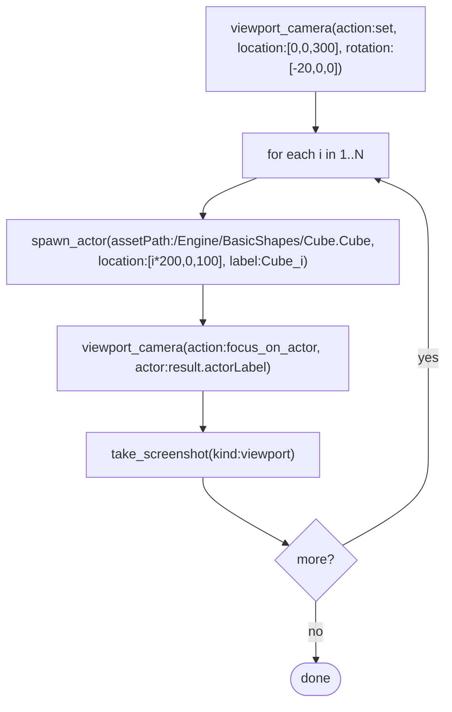

# Recipe — Driving the Level Viewport Camera

Drive the active level editor viewport camera via the `viewport_camera` MCP tool. Backed by native C++ (`RiderAgentTools/Private/ViewportCameraController.cpp`). Validated against UE 5.8 + RiderLink.

Drives the **design-time editor viewport**, not the PIE in-game camera. To move the player view during PIE, use `simulate_input` (see `input/simulate-input.md`).

---

## TL;DR

```
viewport_camera(action:"get")
viewport_camera(action:"set", location:[500,500,800], rotation:[-20,45,0])
viewport_camera(action:"focus_on_actor", actor:"SM_Cube8")
```

---

## Tool contract

| action | Required args | Behaviour |
|---|---|---|
| `get` | — | Returns `{location:{x,y,z}, rotation:{pitch,yaw,roll}}`. |
| `set` | `location [x,y,z]` and/or `rotation [pitch,yaw,roll]` | Replaces supplied fields; omit either to keep current. |
| `move` | `delta [x,y,z]` | Additive. `relative=true` interprets delta as camera-local `[forward,right,up]`; default is world-space. Optional `rotationDelta [pitch,yaw,roll]`. |
| `look_at` | `target [x,y,z]` | Rotates to face the target; location unchanged. |
| `focus_on_actor` | `actor` (Outliner label or FName) | Frames the actor using its bounds. Optional `minDistance` lower-bounds framing distance. |

---

## Recipes

### 1. Read pose

```
viewport_camera(action:"get")
```

Returns `{location:{x,y,z}, rotation:{pitch,yaw,roll}}`.

### 2. Set pose

```
viewport_camera(action:"set", location:[500,500,800], rotation:[-20,45,0])
```

Omit either field to preserve the current value.

### 3. Fly (camera-local axes)

```
viewport_camera(action:"move", delta:[200,0,0], relative:true)
```

`[fwd, right, up]` in camera space. To fly sideways: `[0,200,0]`. To rise: `[0,0,100]`.

### 4. Look at a world point

```
viewport_camera(action:"look_at", target:[0,0,0])
```

### 5. Frame an actor

```
viewport_camera(action:"focus_on_actor", actor:"SM_Cube8")
viewport_camera(action:"focus_on_actor", actor:"SM_Cube8", minDistance:500)
```

---

## Worked example — spawn-and-frame loop

Compose with `spawn_actor` to populate the level and keep each new actor in frame:



---

## Pitfalls

- **Multiple viewports**: operates on the *active* level viewport — whichever was last clicked. No per-viewport selector.
- **Game-mode camera**: during PIE the editor viewport and gameplay camera are independent. `viewport_camera` does NOT move the PIE player view. Use `simulate_input` for that.
- **No interpolation**: these are instant snaps. For a smooth glide, arm a `register_slate_post_tick_callback` (via `ue_execute_python`) that lerps location/rotation over N frames (same pattern as the tick driver in `input/simulate-input.md`).
- **Editor-only**: `focus_on_actor` uses `GetActorLabel()` which is editor-only. Works fine for editor scripting; fails on cooked/standalone targets.

---

## Quick reference

| Need | Call |
|---|---|
| Read camera | `viewport_camera(action:"get")` |
| Set pose | `viewport_camera(action:"set", location:[x,y,z], rotation:[pitch,yaw,roll])` |
| Fly (camera-local) | `viewport_camera(action:"move", delta:[fwd,right,up], relative:true)` |
| Look at world point | `viewport_camera(action:"look_at", target:[x,y,z])` |
| Frame an actor | `viewport_camera(action:"focus_on_actor", actor:"SM_Cube8")` |
| Frame + min distance | add `minDistance:500` |
