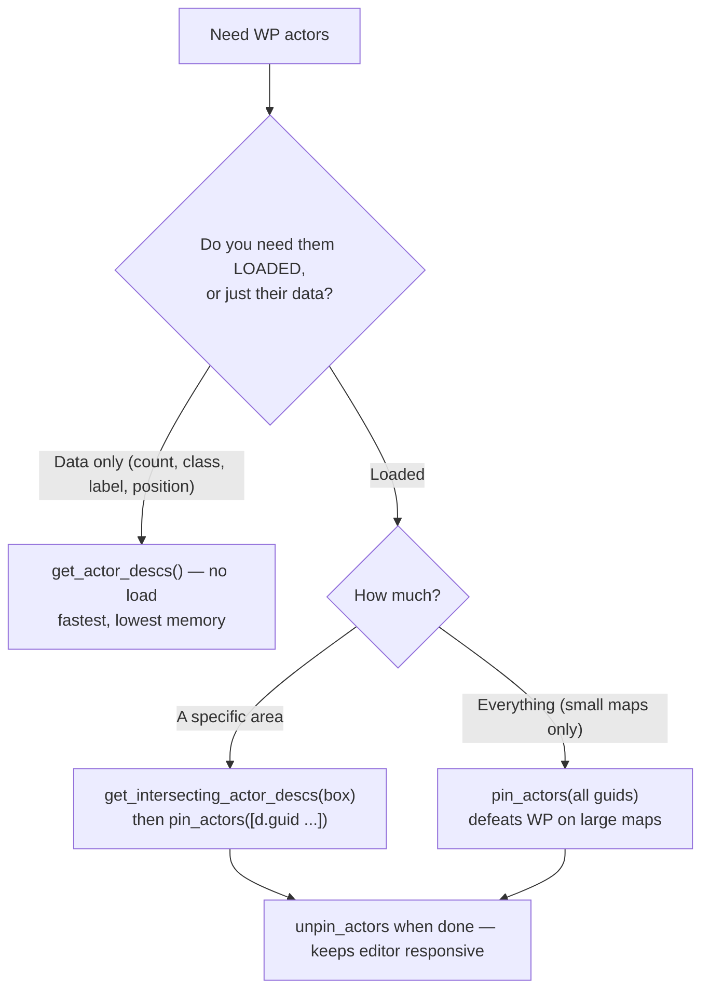

# World Partition Editor Operations

## "Not Loaded Region(s)" Message

Appears when opening a World Partition map. WP maps use spatial streaming — only actors near the editor camera or explicitly loaded are visible. Unloaded areas show as grayed-out grid cells.

## Loading Regions via Python



> `pin_actors` is the reliable force-load (immediate); `load_actors` may defer to a later frame. `get_all_level_actors()` returns **loaded** actors only — use `get_actor_descs()` for the full WP picture.

### Force-Load All Actors
```python
import unreal
wpbl = unreal.WorldPartitionBlueprintLibrary
descs = wpbl.get_actor_descs()
guids = [d.guid for d in descs]
wpbl.pin_actors(guids)
```

### Load Actors in Specific Area
```python
box = unreal.Box()
box.min = unreal.Vector(-5000, -5000, -1000)
box.max = unreal.Vector(5000, 5000, 5000)
descs = wpbl.get_intersecting_actor_descs(box)
wpbl.pin_actors([d.guid for d in descs])
```

### Unpin (Allow Unloading)
```python
wpbl.unpin_actors(guids)
```

## Key API: WorldPartitionBlueprintLibrary

| Method | Purpose |
|--------|---------|
| `get_actor_descs()` | All actor descriptors (loaded + unloaded) |
| `get_intersecting_actor_descs(box)` | Descriptors within bounding box |
| `get_editor_world_bounds()` | Full world extent |
| `pin_actors(guids)` | **Force-load and keep loaded** (most reliable) |
| `unpin_actors(guids)` | Allow actors to unload |
| `load_actors(descs)` | Request load (may defer) |
| `unload_actors(descs)` | Explicitly unload |

## ActorDesc Properties

```python
d.label              # FName — editor label (use str() for string ops)
d.name               # FName — internal name
d.guid               # FGuid — use for pin/unpin
d.native_class       # UClass reference
d.actor_package      # External actor file path
d.is_spatially_loaded # True = streams by distance
d.data_layer_assets  # Data layer assignments
d.runtime_grid       # Runtime grid name
```

## Gotchas

- `pin_actors()` takes **array of FGuid**, NOT ActorDesc objects
- `load_actors()` takes ActorDesc array but may not load in same frame
- `get_all_level_actors()` only returns **loaded** actors — use `get_actor_descs()` for full WP picture
- ActorDesc `.label` is `FName` — convert with `str()` before `.startswith()` etc.
- External actors stored in `__ExternalActors__/` directory alongside the `.umap`

## Querying Without Loading

```python
descs = wpbl.get_actor_descs()
# Filter by class
spawners = [d for d in descs if d.native_class and d.native_class.get_name() == "WeaponSpawner"]
# Filter by label
walls = [d for d in descs if str(d.label).startswith("Wall_")]
# Count by class
class_counts = {}
for d in descs:
    cls = d.native_class.get_name() if d.native_class else "Unknown"
    class_counts[cls] = class_counts.get(cls, 0) + 1
```

## Best Practices

1. **Don't pin everything on large maps** — defeats WP purpose, high memory
2. **Use `pin_actors`** over `load_actors` — guaranteed immediate load
3. **Filter with `get_intersecting_actor_descs`** to load only the area you need
4. **Unpin when done** to keep editor responsive
5. **`is_spatially_loaded=True`** actors stream by distance; `False` = always loaded
