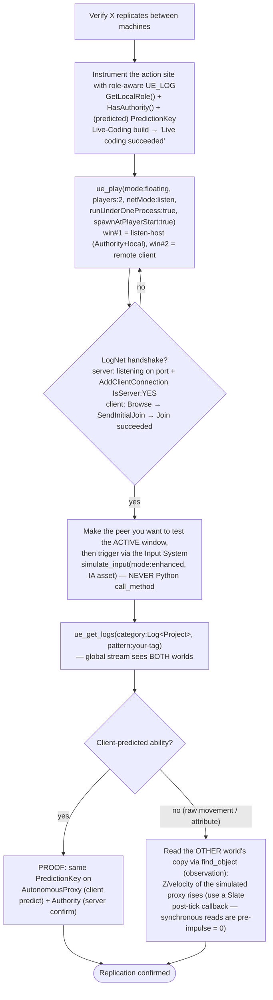
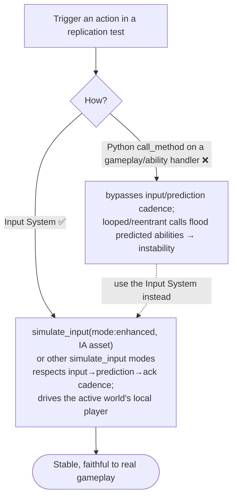

# Testing Replication in PIE — Fast, Safe Workflow

How to **prove** a gameplay action (jump, ability, movement, attribute) replicates between machines in PIE. Generic recipe — applies to any project/map.

Two graphs: **(1)** the fast verify loop, **(2)** the one hard rule about *how* you trigger the action.

---

## MANDATORY — drive actions through the Input System, never via Python

> **Trigger gameplay actions with the Input System.** Use Enhanced-Input injection of the real `IA_*` asset (`simulate_input mode:enhanced`) or the other `simulate_input` modes. **Do NOT call gameplay/ability handlers directly via `ue_execute_python` `call_method`** (e.g. an activation function, `TryActivateAbility*`, a jump handler). A direct Python call bypasses the input → prediction → server-ack cadence; for client-predicted abilities, looped or reentrant Python calls flood the prediction window and destabilise the ability system.
>
> **Python is for OBSERVATION only** — reading roles, locations, velocities, and logs. Never for *driving* input.

---

## Key facts that make this fast

- **The PIE log stream spans ALL worlds in the process.** With `runUnderOneProcess=true`, server and client worlds write to the *same* `ue_get_logs` stream. **Role-aware `UE_LOG` is therefore the cross-world observation channel** — you see both sides of a replicated event in one stream without reading both worlds' actors.
- **Input simulation drives the ACTIVE PIE world's local player.** `simulate_input` / Enhanced-Input injection act on whichever PIE window is active (typically the listen-server host, player 0). To exercise a *specific* peer, make that peer's window active, then drive it through the Input System.
- **`simulate_input`'s `jump` calls `ACharacter::Jump()` directly**, bypassing input bindings *and* any ability path. To exercise the real binding → ability path, inject the actual `IA_*` asset with `mode:enhanced`.
- **`get_game_world()` returns only ONE world** (instance 0 = the listen server). To *read* another peer's world from Python, address it by its PIE-prefixed package name (observation only):
  ```python
  import unreal
  # Instance 0 = server (listen host), 1 = first client, 2 = second client, ...
  SERVER = unreal.find_object(None, "/Game/<Dir>/UEDPIE_0_<Map>.<Map>")
  CLIENT = unreal.find_object(None, "/Game/<Dir>/UEDPIE_1_<Map>.<Map>")
  pawn   = unreal.GameplayStatics.get_player_controller(CLIENT, 0).get_controlled_pawn()
  print(pawn.get_name(), pawn.get_local_role())   # client's own pawn = AutonomousProxy
  ```
- **For a client-predicted ability, the proof is a matching prediction key on both sides:** the same activation logs `NetRole=AutonomousProxy` (client predicts) **and** `NetRole=Authority` (server confirms) with the **same `PredictionKey`**.

---

## Graph 1 — Verify replication in PIE



### Role-aware log pattern (the cross-world channel)

```cpp
// At the action / ability-activation site:
UE_LOG(LogYourProject, Warning,
  TEXT("[REP] %s on %s | NetRole=%s | HasAuthority=%d | PredictionKey=%d"),
  TEXT("ActivateAbility"), *GetNameSafe(Avatar),
  *UEnum::GetValueAsString(Avatar->GetLocalRole()),   // or a small ENetRole→str helper
  ActorInfo->IsNetAuthority() ? 1 : 0,
  ActivationInfo.GetActivationPredictionKey().Current);
```
A single **client** action then prints, in the one log stream:
`...AutonomousProxy...PredictionKey=N` (client world) **and** `...Authority...PredictionKey=N` (server world). Matching `N` = the predicted activation crossed the network and was confirmed.

---

## Graph 2 — How to trigger the action (the one rule)



---

## Topology quick-pick (for replication tests)

| Goal | `ue_play` call |
|------|----------------|
| Server + 1 client, one process (default) | `mode:floating, players:2, netMode:listen, runUnderOneProcess:true, spawnAtPlayerStart:true` |
| Server + N clients | same, `players:N+1` |
| Dedicated-server topology | `players:N, netMode:client, dedicatedServer:true, runUnderOneProcess:true` |

See `editor/pie-tools.md` for the handshake-verify chart, `input/` for Enhanced-Input injection, and `networking/gas-networking.md` for ASC replication modes / prediction defaults.
